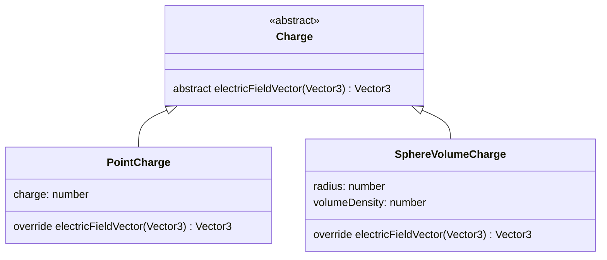

# EFSim [](https://github.com/CaseyNelson314/EFSim/actions/workflows/deploy.yml)

三次元電界シミュレータ <https://caseynelson314.github.io/EFSim/>


## 使用方法

ドラッグで視点の回転、Shift+ドラッグで視点の移動ができます。

左上の各電荷ボタンを押すことで、シミュレーション空間に電荷を追加できます。

空間内で電荷を選択することで、パラメータ編集モードに切り替わり、電荷の位置、回転角、電荷量、電荷密度などのパラメーターを編集できます。(編集できるパラメータは電荷の種類によって異なります)

## 電界強度式 電界ベクトル式

- 点電荷

$$
E(r) = \frac{Q}{4 \pi \varepsilon_0 r^{2}}
\qquad
\vec{E}(\vec{r}) = \frac{Q}{4 \pi \varepsilon_0 \lvert\vec{r}\rvert^{3}} \vec{r}
$$

- 無限長線電荷

$$
E(r) = \frac{\lambda}{2 \pi \varepsilon_0 r}
\qquad
\vec{E}(\vec{r}) = \frac{\lambda}{2 \pi \varepsilon_0\lvert\vec{r}\rvert^{2}} \vec{r}
$$

- 無限面電荷

$$
E(r) = \frac{\sigma}{2 \varepsilon_0}
\qquad
\vec{E}(\vec{r}) = \frac{\sigma}{2 \varepsilon_0 \lvert\vec{r}\rvert} \vec{r}
$$

- 球表面電荷

$$
\begin{cases}
  E(r) = \frac{\sigma a^{2}}{\varepsilon_0 r^{2}} & (a \leq r) \\
  E(r) = 0 & (0 \leq r < a)
\end{cases}
\qquad
\begin{cases}
  \vec{E}(\vec{r}) = \frac{\sigma a^{2}}{\varepsilon_0 \lvert\vec{r}\rvert^{3}} \vec{r} & (a \leq \lvert\vec{r}\rvert) \\
  \vec{E}(\vec{r}) = \vec{0} & (0 \leq \lvert\vec{r}\rvert < a)
\end{cases}
$$

- 球体積電荷

$$
\begin{cases}
  E(r) = \frac{\rho a^{3}}{3 \varepsilon_0 r^{2}} & (a \leq r) \\
  E(r) = \frac{\rho r}{3 \varepsilon_0} & (0 \leq r < a)
\end{cases}
\qquad
\begin{cases}
  \vec{E}(\vec{r}) = \frac{\rho a^{3}}{3 \varepsilon_0 \lvert\vec{r}\rvert^{3}} \vec{r} & (a \leq \lvert\vec{r}\rvert) \\
  \vec{E}(\vec{r}) = \frac{\rho}{3 \varepsilon_0} \vec{r} & (0 \leq \lvert\vec{r}\rvert < a)
\end{cases}
$$

- 円筒表面電荷

$$
\begin{cases}
  E(r) = \frac{\sigma a}{\varepsilon_0 r} & (a \leq r) \\
  E(r) = 0 & (0 \leq r < a)
\end{cases}
\qquad
\begin{cases}
  \vec{E}(\vec{r}) = \frac{ \sigma a}{\varepsilon_0 \lvert\vec{r}\rvert^{2}} \vec{r} & (a \leq \lvert\vec{r}\rvert) \\
  \vec{E}(\vec{r}) = \vec{0} & (0 \leq \lvert\vec{r}\rvert < a)
\end{cases}
$$

- 円筒体積電荷

$$
\begin{cases}
  E(r) = \frac{\rho a^{2}}{2 \varepsilon_0 r} & (a \leq r) \\
  E(r) = \frac{\rho r}{2 \varepsilon_0} & (0 \leq r < a)
\end{cases}
\qquad
\begin{cases}
  \vec{E}(\vec{r}) = \frac{\rho a^{2}}{2 \varepsilon_0 \lvert\vec{r}\rvert^{2}} \vec{r} & (a \leq \lvert\vec{r}\rvert) \\
  \vec{E}(\vec{r}) = \frac{\rho}{2 \varepsilon_0} \vec{r} & (0 \leq \lvert\vec{r}\rvert < a)
\end{cases}
$$

- 式中の記号詳細

  |       値        |         意味         |       単位       |
  | :-------------: | :------------------: | :--------------: |
  |       $E$       |       電界強度       |  $\mathrm{V/m}$  |
  |    $\vec{E}$    |     電界ベクトル     | $(\mathrm{V/m})$ |
  |       $r$       |     電荷との距離     |   $\mathrm{m}$   |
  |    $\vec{r}$    | 電荷との距離ベクトル |  $(\mathrm{m})$  |
  | $\varepsilon_0$ |    真空中の誘電率    |  $\mathrm{F/m}$  |
  |       $q$       |        電荷量        |   $\mathrm{C}$   |
  |    $\lambda$    |      線電荷密度      |  $\mathrm{C/m}$  |
  |    $\sigma$     |      面電荷密度      | $\mathrm{C/m^2}$ |
  |     $\rho$      |     体積電荷密度     | $\mathrm{C/m^3}$ |
  |       $a$       |         半径         |   $\mathrm{m}$   |

## 開発者用

### ローカル実行

[ターミナル](https://apps.microsoft.com/detail/9N0DX20HK701?hl=ja-jp&gl=JP) [NodeJS](https://nodejs.org/en/download/package-manager#windows-1) [Git](https://git-scm.com/download/win) を使用します。ターミナルを開き、以下のコマンドを実行することで、ローカル環境でアプリケーションを実行できます。

GitHub から本プロジェクトをクローン

```sh
git clone https://github.com/CaseyNelson314/EFSim.git
cd EFSim
npm install
```

ローカルサーバーを起動

```sh
npm run dev
```

表示される URL をクリックしブラウザを起動

### ディレクトリ構造

```
.github/
    workflows/
        deploy.yml  ...自動デプロイスクリプト

app/
    script/     ...TypeScriptファイル置き場
    static/     ...画像等置き場
    style/      ...CSSファイル置き場
    index.html  ...Webページ

.clang-format   ...コードの自動整形設定ファイル
```

### 電気力線の描画手法

[three.js](https://threejs.org/) フレームワークを使い描画を行っています。TypeScript で記述しています。

電気力線は電界ベクトルをつないだ線であるため、以下のアルゴリズムで生成できます。

1. 電気力線の出る適当な方向を決め、その方向に力線を長さ 1 だけ進める。

2. 進めた先の座標における電界ベクトルを求め、その方向に力線を長さ 1 だけ進める。

3. 2.を他の電荷に当たる、長さ制限になるまで繰り返し 1 本の電気力線を生成。

4. 1.で決める方向を調整することで複数の電気力線を生成。

   

### クラス相関

各電荷は各電荷クラスを基に作成されます。各電荷クラスは `Charge` 抽象クラスを継承しています。また各電荷に共通する処理を仮想関数として `Charge` クラス内で宣言し、各電荷クラスが実装しています。

以下に `PointCharge` (点電荷)、`SphereVolumeCharge` (球内に均一に分布する電荷) が `Charge` クラスを継承している例を示します。ここでは任意の座標の電界ベクトルを取得できる `electricFieldVector` 関数を各電荷クラス側がオーバーライドし実装しています。



通常異なる型のオブジェクトを配列で管理することはできませんが、各電荷クラスが `Charge` クラスを継承したことで、異なる種類の電荷クラスのオブジェクトを配列で管理できるようになっています。

```ts
const charges: Charge[] = [];

charges.push(new PointCharge(...));
charges.push(new SphereVolumeCharge(...));
```

配列で管理できるようになると電荷の種類に依存しないコードを記述できます。たとえば次のようなコードで、任意の座標での全電荷からの電界ベクトルを求めることができます。

```ts
// 電荷の配列
const charges: Charge[] = [];

// 点電荷、球体積電荷を追加
charges.push(new PointCharge(...));
charges.push(new SphereVolumeCharge(...));

// 電界ベクトルを合成
let electricFieldVector = new THREE.Vector3();
for (const charge of charges) {
    electricFieldVector.add(charge.electricFieldVector(position));
}
```

### 新しい種類の電荷を追加する

1. 電荷追加用ボタンを追加

   app/index.html を開き、電荷追加ボタン領域の要素内にボタン要素を追加します。ボタンを作成する際、電荷のイメージ画像が必要になります。イメージ画像は app/static ディレクトリに置いています。

   電荷追加ボタン領域

   ```html
   <!-- 電荷追加ボタン領域 -->
   <div class="charge_control">
     <div class="control_button">
       <p class="title">点</p>
       <button type="button" id="add_point_charge_button">
         
       </button>
     </div>
     <div class="control_button">
       <p class="title">無限線</p>
       <button type="button" id="add_infinity_line_charge_button">
         
       </button>
     </div>
     <!--ここに追加--->
   </div>
   ```

   ボタン要素

   ```html
   <div class="control_button">
     <p class="title">電荷名</p>
     <button type="button" id="電荷のID(後でプログラム中で使用)">
       
     </button>
   </div>
   ```

2. スクリプトファイルの追加

   app/script ディレクトリに TypeScript ファイルを作成します。ファイル名は追加する電荷の名前と合わせるのがおすすめです。

3. 電荷クラスを定義、関数を定義

   各電荷はオブジェクトとして管理されるため、オブジェクトの構造を定義するクラスを作成する必要があります。

   また、電荷のクラスを作成する際、 `Charge` クラスを継承し、このクラスに含まれる抽象メソッドを全て実装(オーバーライド)する必要があります。

   以下は定義例です。メンバ関数の実装は 5. で説明します。`distanceFrom` は抽象関数ではないですが、後々あると便利なので定義しておきます。

   ```ts
   import { Charge } from "./charge";

   export class 追加する電荷名 extends Charge {
     /**
      * 電荷の正負を取得する
      * @returns 電荷の正負
      */
     override getChargeType = (): ChargeType => {};

     /**
      * 任意の座標における電荷との距離ベクトルを取得する
      * @param position 任意の座標
      * @returns 電荷との距離ベクトル
      */
     private distanceFrom = (position: THREE.Vector3): THREE.Vector3 => {};

     /**
      * 任意の座標が電荷に接触しているかどうかを判定する
      * @param position 任意の座標
      * @param threshold 閾値
      * @returns 接触しているかどうか
      */
     override isContact = (
       position: THREE.Vector3,
       threshold: number
     ): boolean => {};

     /**
      * 任意の座標における、この電荷からの電界ベクトルを返す
      * @param position 任意の座標
      * @returns 電界ベクトル
      */
     override electricFieldVector = (
       position: THREE.Vector3
     ): THREE.Vector3 => {};

     /**
      * 電気力線の始点、方向ベクトルの配列を返す
      * @returns 電気力線の始点、方向ベクトルの配列
      */
     override electricForceLinesDirection = (): {
       begin: THREE.Vector3;
       direction: THREE.Vector3;
     }[] => {};

     /**
      * 解放
      * @note ジオメトリの破棄等を行う
      */
     override dispose = (): void => {};

     /**
      * JSONから電荷を生成する
      */
     static override fromJSON = (json: any): Charge => {};

     /**
      * 電荷をJSONに変換する
      */
     override toJSON = () => {};

     /**
      * パラメーター設定用エディタを生成する
      */
     override createEditor = (): Editor => {};
   }
   ```

4. メンバ変数を定義

   メンバ変数を定義することで、各電荷が電荷量や、半径、サイズなどを個別に持つことができるようになります。

   そのほかに、3D オブジェクトの素材、色を決定するマテリアルを各電荷クラスはメンバ変数に持っています。

   複数特定の電荷を作成した際に、固有の値を持つ必要がない電荷については 静的メンバ変数を使用ます。例えば点電荷は電荷の半径を変更することがないので、半径を決定するジオメトリを静的メンバ変数で持っています。

   点電荷の例を示します。

   ```ts
   class PointCharge extends Charge {
     private charge: number;

     private static readonly plusMaterial = new THREE.MeshBasicMaterial({
       color: 0xff0000,
     });
     private static readonly minusMaterial = new THREE.MeshBasicMaterial({
       color: 0x0000ff,
     });
     private static readonly neutralMaterial = new THREE.MeshBasicMaterial({
       color: 0xffff00,
     });
     private static readonly pointChargeGeometry = new THREE.SphereGeometry(
       4, // 半径
       32, // widthSegments
       32 // heightSegments
     );
   }
   ```

5. 各メンバ関数の実装

   3 でオーバーライドした `Charge` クラスの抽象関数の実装を行います。

   TypeScript の関数構文は次のようになっています。

   ```ts
   (引数): 戻り値 => {
     関数内部;
   };
   ```

   各関数の説明を以下に示します。

   - `getChargeType(): ChargeType`

     電荷が、正、負、中性であるかを取得できる関数です。実装は比較的簡単で、charge.ts に含まれる `ChargeToChargeType` 関数インポートし使用すると比較的簡単に定義できます。

     ```ts
     import { Charge, ChargeType, ChargeToChargeType } from "./charge";
     ```

     ```ts
     override getChargeType = (): ChargeType => {
        return ChargeToChargeType(電荷量、面密度等);
     };
     ```

   - `distanceFrom(position: THREE.Vector3): THREE.Vector3`

     任意の座標との最短距離ベクトルを求める関数です。
     
     注意点として線、面のような電荷は、`this.position` との引き算で求めることができません。(最短距離を求める必要があるため)。また回転が絡んでくるとクオータニオンを適用して計算を行う必要があります。

   - `isContact(position: THREE.Vector3, threshold: number): boolean`

     任意の座標 (`position`) が電荷と接触しているか取得する関数です。距離が 0 になる確率は極めて低いため、閾値を設けています。電荷との距離が、閾値以下になると `true` を返し、それ以外は `false` を返すように実装します。

   - `electricFieldVector(position: THREE.Vector3): THREE.Vector3`

     任意の座標における、この電荷からの電界ベクトルを取得できる関数です。`distanceFrom` から求められる差分ベクトルを用いて、電界ベクトルを求めるように実装します。

   - `electricForceLinesDirection(): { begin: THREE.Vector3; direction: THREE.Vector3; }[]`

      電気力線を生成するには始点、力線の出る方向のベクトルが必要です。この関数はその電気力線の始点、方向ベクトルの配列を取得する関数です。


