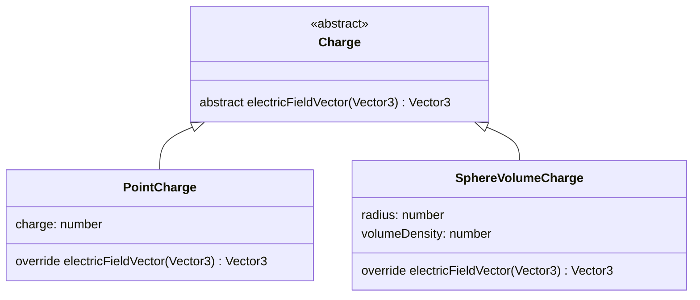

# EFSim [](https://github.com/CaseyNelson314/EFSim/actions/workflows/deploy.yml)


三次元電界シミュレータ

<https://caseynelson314.github.io/EFSim/>

## 使用方法

ドラッグで視点の回転、Shift+ドラッグで視点の移動ができます。

左上の各電荷ボタンを押すことで、シミュレーション空間に電荷を追加できます。

空間内で電荷を選択することで、パラメータ編集モードに切り替わり、電荷の位置、回転角、電荷量、電荷密度などのパラメーターを編集できます。(編集できるパラメータは電荷の種類によって異なります)

## 電界ベクトル式算出

ガウスの法則より電界の強さを求め、電界ベクトルを求める。

$$
\sum EndS = \frac{\sum Q}{\varepsilon_0}
$$

電荷の種別ごとの電界、電界ベクトル算出式

| 電荷種別     |                                                                     電界(スカラ)                                                                     |                                                                                                               電界(ベクトル)                                                                                                               |
| ------------ | :--------------------------------------------------------------------------------------------------------------------------------------------------: | :----------------------------------------------------------------------------------------------------------------------------------------------------------------------------------------------------------------------------------------: |
| 点電荷       |                                                    $ E(r) = \frac{Q}{4 \pi \varepsilon_0 r^{2}} $                                                    |                                                                              $ \bm{E}(\bm{r}) = \frac{Q}{4 \pi \varepsilon_0 \lvert\bm{r}\rvert^{3}} \bm{r} $                                                                              |
| 無限長線電荷 |                                                   $ E(r) = \frac{\lambda}{2 \pi \varepsilon_0 r} $                                                   |                                                                           $ \bm{E}(\bm{r}) = \frac{\lambda}{2 \pi \varepsilon_0\lvert\bm{r}\rvert^{2}} \bm{r} $                                                                            |
| 無限面電荷   |                                                      $ E(r) = \frac{\sigma}{2 \varepsilon_0} $                                                       |                                                                               $ \bm{E}(\bm{r}) = \frac{\sigma}{2 \varepsilon_0 \lvert\bm{r}\rvert} \bm{r}$                                                                                |
| 球表面電荷   |               $ \begin{cases} E(r) = \frac{\sigma a^{2}}{\varepsilon_0 r^{2}} & (a \leq r) \\ E(r) = 0 & (0 \leq r < a) \end{cases} $                |                 $ \begin{cases} \bm{E}(\bm{r}) = \frac{\sigma a^{2}}{\varepsilon_0 \lvert\bm{r}\rvert^{3}} \bm{r} & (a \leq \lvert\bm{r}\rvert) \\ \bm{E}(\bm{r}) = \bm{0} & (0 \leq \lvert\bm{r}\rvert < a) \end{cases} $                 |
| 球体積電荷   | $ \begin{cases} E(r) = \frac{\rho a^{3}}{3 \varepsilon_0 r^{2}} & (a \leq r) \\ E(r) = \frac{\rho r}{3 \varepsilon_0} & (0 \leq r < a) \end{cases} $ | $ \begin{cases} \bm{E}(\bm{r}) = \frac{\rho a^{3}}{3 \varepsilon_0 \lvert\bm{r}\rvert^{3}} \bm{r} & (a \leq \lvert\bm{r}\rvert) \\ \bm{E}(\bm{r}) = \frac{\rho}{3 \varepsilon_0} \bm{r} & (0 \leq \lvert\bm{r}\rvert < a) \end{cases} $ 　 |
| 円筒表面電荷 |                   $ \begin{cases} E(r) = \frac{\sigma a}{\varepsilon_0 r} & (a \leq r) \\ E(r) = 0 & (0 \leq r < a) \end{cases} $                    |                  $ \begin{cases} \bm{E}(\bm{r}) = \frac{ \sigma a}{\varepsilon_0 \lvert\bm{r}\rvert^{2}} \bm{r} & (a \leq \lvert\bm{r}\rvert) \\ \bm{E}(\bm{r}) = \bm{0} & (0 \leq \lvert\bm{r}\rvert < a) \end{cases} $                   |
| 円筒体積電荷 |   $ \begin{cases} E(r) = \frac{\rho a^{2}}{2 \varepsilon_0 r} & (a \leq r) \\ E(r) = \frac{\rho r}{2 \varepsilon_0} & (0 \leq r < a) \end{cases} $   |  $ \begin{cases} \bm{E}(\bm{r}) = \frac{\rho a^{2}}{2 \varepsilon_0 \lvert\bm{r}\rvert^{2}} \bm{r} & (a \leq \lvert\bm{r}\rvert) \\ \bm{E}(\bm{r}) = \frac{\rho}{2 \varepsilon_0} \bm{r} & (0 \leq \lvert\bm{r}\rvert < a) \end{cases} $   |

|        値         |         意味         |        単位        |
| :---------------: | :------------------: | :----------------: |
| $ \varepsilon_0 $ |    真空中の誘電率    |  $ \mathrm{F/m} $  |
|       $ q $       |        電荷量        |   $ \mathrm{C} $   |
|    $ \lambda $    |      線電荷密度      |  $ \mathrm{C/m} $  |
|    $ \sigma $     |      面電荷密度      | $ \mathrm{C/m^2} $ |
|     $ \rho $      |     体積電荷密度     | $ \mathrm{C/m^3} $ |
|       $ r $       |     電荷との距離     |   $ \mathrm{m} $   |
|    $ \bm{r} $     | 電荷との距離ベクトル |  $ (\mathrm{m}) $  |
|       $ a $       |         半径         |   $ \mathrm{m} $   |

## 開発者用

### ローカル実行

[ターミナル](https://apps.microsoft.com/detail/9N0DX20HK701?hl=ja-jp&gl=JP) [NodeJS](https://nodejs.org/en/download/package-manager#windows-1) [Git](https://git-scm.com/download/win) を使用します。ターミナルを開き、以下のコマンドを実行することで、ローカル環境でアプリケーションを実行できます。

GitHub から本プロジェクトをクローン

```sh
git clone https://github.com/CaseyNelson314/EFSim.git
cd EFSim
npm install
```

ローカルサーバーを起動

```sh
npm run dev
```

表示される URL をクリックしブラウザを起動

### ディレクトリ構造

```
.github/
    workflows/
        deploy.yml  ...自動デプロイスクリプト

app/
    script/     ...TypeScriptファイル置き場
    static/     ...画像等置き場
    style/      ...CSSファイル置き場
    index.html  ...Webページ

.clang-format   ...コードの自動整形設定ファイル
```

### 電気力線の描画手法

[three.js](https://threejs.org/) フレームワークを使い描画を行っています。TypeScript で記述しています。

電気力線は電界ベクトルをつないだ線であるため、以下のアルゴリズムで生成できます。

1. 電気力線の出る適当な方向を決め、その方向に力線を長さ 1 だけ進める。

2. 進めた先の座標における電界ベクトルを求め、その方向に長さ 1 の力線を長さ 1 だけ進める。

3. 2.を他の電荷に当たる、長さ制限になるまで繰り返し 1 本の電気力線を生成。

4. 1.で決めた方向を調整することで複数の電気力線を生成。

   

### クラス相関

各電荷は各電荷クラスを基に作成されます。各電荷クラスは `Charge` 抽象クラスを継承しています。また各電荷に共通する処理を仮想関数として `Charge` クラス内で宣言し、各電荷クラスが実装しています。

以下に `PointCharge` (点電荷)、`SphereVolumeCharge` (球内に均一に分布する電荷) が `Charge` クラスを継承している例を示します。ここでは任意の座標の電界ベクトルを取得できる `electricFieldVector` 関数を各電荷クラス側がオーバーライドし実装しています。



通常異なる型のオブジェクトを配列で管理することはできませんが、各電荷クラスが `Charge` クラスを継承したことで、電荷クラスのオブジェクトを配列で管理できるようになっています。

```typescript
const charges: Charge[] = [];

charges.push(new PointCharge(...));
charges.push(new SphereVolumeCharge(...));
```

配列で管理できるようになると電荷の種類に依存しないコードを記述できます。たとえば次のようなコードで、任意の座標での全電荷からの電界ベクトルを求めることができます。

```typescript
// 電荷の配列
const charges: Charge[] = [];

// 点電荷、球体積電荷を追加
charges.push(new PointCharge(...));
charges.push(new SphereVolumeCharge(...));

// 電界ベクトルを合成
let electricFieldVector = new THREE.Vector3();
for (const charge of charges) {
    electricFieldVector.add(charge.electricFieldVector(position));
}
```

### 新しい種類の電荷を追加する

1. app/script/ ディレクトリに適当な名前の TypeScript ファイルを作成

2. 電荷クラスを追加

   追加する電荷クラスを作成し、`Charge` クラスを継承する。

   メインファイルから参照できるようにクラスをエクスポートしておく。

   また依存する関数やクラスがある場合、適宜インポートする。

   ```typescript
   import { Charge } from "./charge";

   export class SampleCharge extends Charge {}
   ```

<!-- 3. メンバ変数を追加

   追加する電荷の種類によってメンバ変数の構成が変わるため、円筒電荷の例を示す。

   ```typescript
   export class InfinityCylinderSurfaceCharge extends Charge {
     private radius: number; // 半径
     private arealDensity: number; // 面密度

     // 電荷の素材を作成 ()
     private static readonly plusMaterial = new THREE.MeshBasicMaterial({
       color: 0xff0000,
     });
     private static readonly minusMaterial = new THREE.MeshBasicMaterial({
       color: 0x0000ff,
     });
     private static readonly neutralMaterial = new THREE.MeshBasicMaterial({
       color: 0xffff00,
     });
   }
   ```

4. 仮想関数のオーバーライド
5. -->
